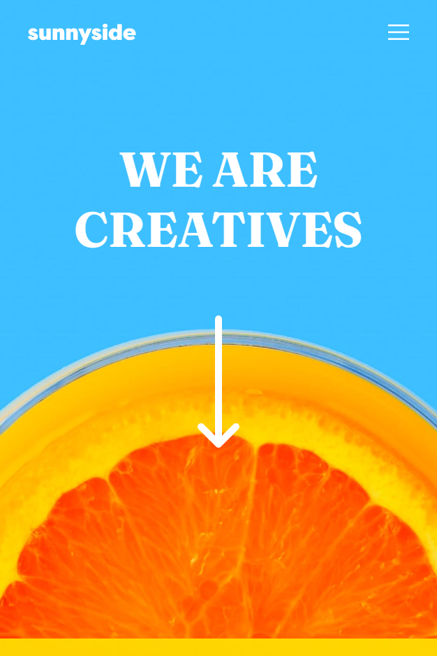

# Frontend Mentor - Product preview card component solution

This is a solution to the [Product preview card component challenge on Frontend Mentor](https://www.frontendmentor.io/challenges/product-preview-card-component-GO7UmttRfa). Frontend Mentor challenges help you improve your coding skills by building realistic projects.

 

*Esta é uma solução para o [desafio do componente do cartão de visualização do produto no Frontend Mentor](https://www.frontendmentor.io/challenges/product-preview-card-component-GO7UmttRfa). Os desafios do Frontend Mentor ajudam você a melhorar suas habilidades de codificação criando projetos realistas.*

## 💻 Overview

Users should be able to:

 

*Os usuários devem ser capazes de:*

 

- [x] **View the optimal layout depending on their device's screen size**
- [x] *Veja o layout ideal dependendo do tamanho da tela do dispositivo*

- [x] **See hover and focus states for interactive elements**
- [x] *Veja os estados de foco e foco para elementos interativos*

## My process

### :rocket: Built with

-  [Vue](https://vuejs.org/guide/introduction.html)
-  [Vue Router](https://router.vuejs.org/)
-  [Semantic HTML5 markup](https://www.w3schools.com/html/html5_semantic_elements.asp/)
-  [CSS custom properties](https://developer.mozilla.org/en-US/docs/Web/CSS/Using_CSS_custom_properties/)
-  [Flexbox](https://www.w3schools.com/css/css3_flexbox.asp/)
-  [CSS Grid](https://developer.mozilla.org/en-US/docs/Web/CSS/CSS_Grid_Layout/)
-  [Mobile-first workflow](https://developer.mozilla.org/en-US/docs/Web/Progressive_web_apps/Responsive/Mobile_first/)

### What I learned

With this challenge I reinforced my knowledge with css and responsive design

 

*Com este desafio reforcei meus conhecimentos com css e o design responsivo*

## Author

- Frontend Mentor - [@guilherme-studier](https://www.frontendmentor.io/profile/guilherme-studier)
- Twitter - [@guistudier](https://www.twitter.com/guistudier)

## View

- https://jade-horse-f44955.netlify.app/
